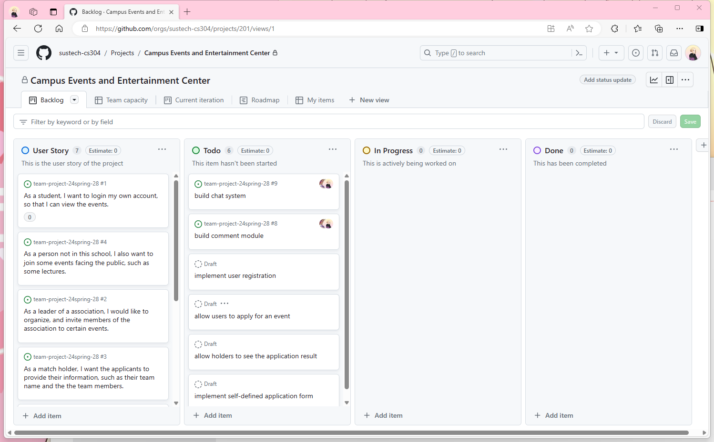

# CS304 Project Proposal

**Project name: Campus Events and Entertainment Center**

**Group members: **

## Part I. Project Proposal

### Project Overview

+ target users
+ functionalities
+ overall goal

### Preliminary Requirement Analysis

#### Functional Requirements

1. a

   The system should blabla...

2. b

   You can blabla...

3. c

4. d

5. e

#### Non-functional Requirements

1. a
2. b
3. c
4. d
5. e

#### Data Requirements

#### Technical Requirements

## Part II. Task Decomposition & Planning

The url for the project board: [Backlog · Campus Events and Entertainment Center (github.com)](https://github.com/orgs/sustech-cs304/projects/201)

**Just an example:**

## Part III. AI Usage

***THIS PART should be done by WYR***

Our group comes up with the features, requirements, user stories, issues and tasks on our own, without AI assistance.

As the proposal requires, we try using AI to generate those contents and compare them with our works.

### Experiments

**AI we used: ChatGPT-4.0** (To wyr: ask me for the API key, I got some money left and needed to spend it in this month)

#### Features

**Prompt:**

**Generated Contents:**

**Analysis:**

#### Requirements

**Prompt:**

**Generated Contents:**

**Analysis:**

#### User Stories

**Prompt:**

**Generated Contents:**

**Analysis:**

#### Issues & tasks

**Prompt:**

**Generated Contents:**

**Analysis:**

### Conclusion

