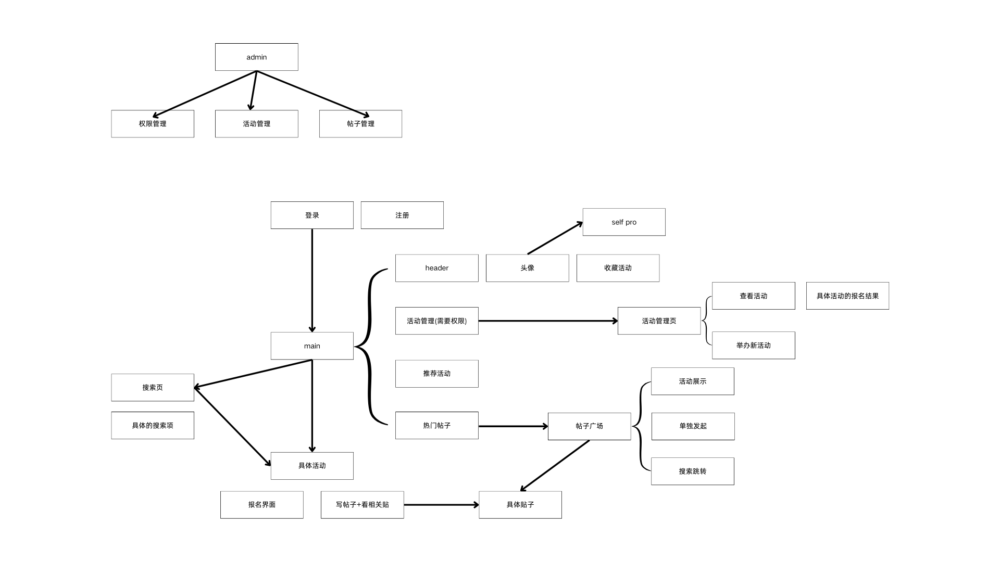
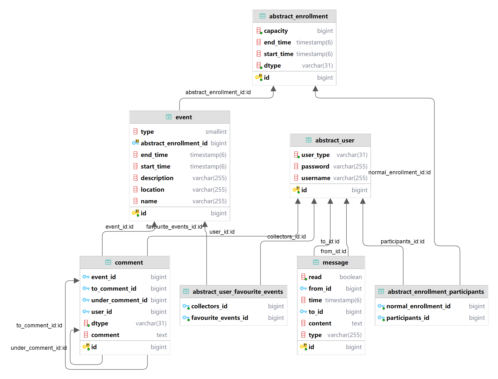
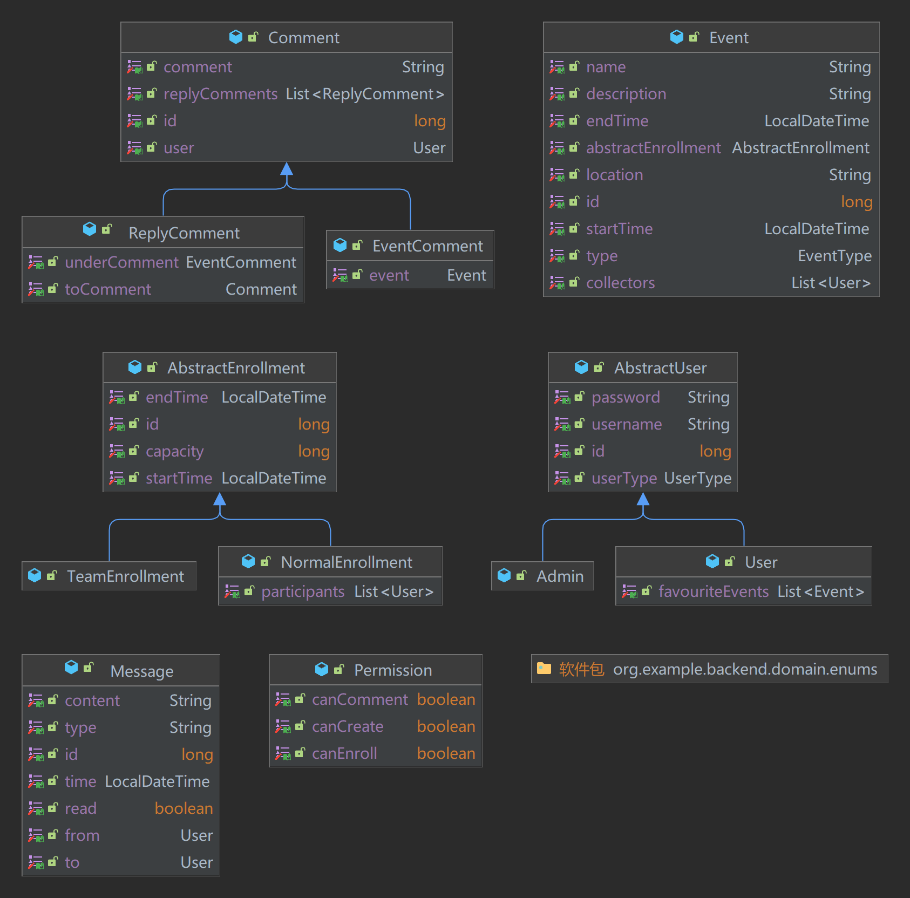
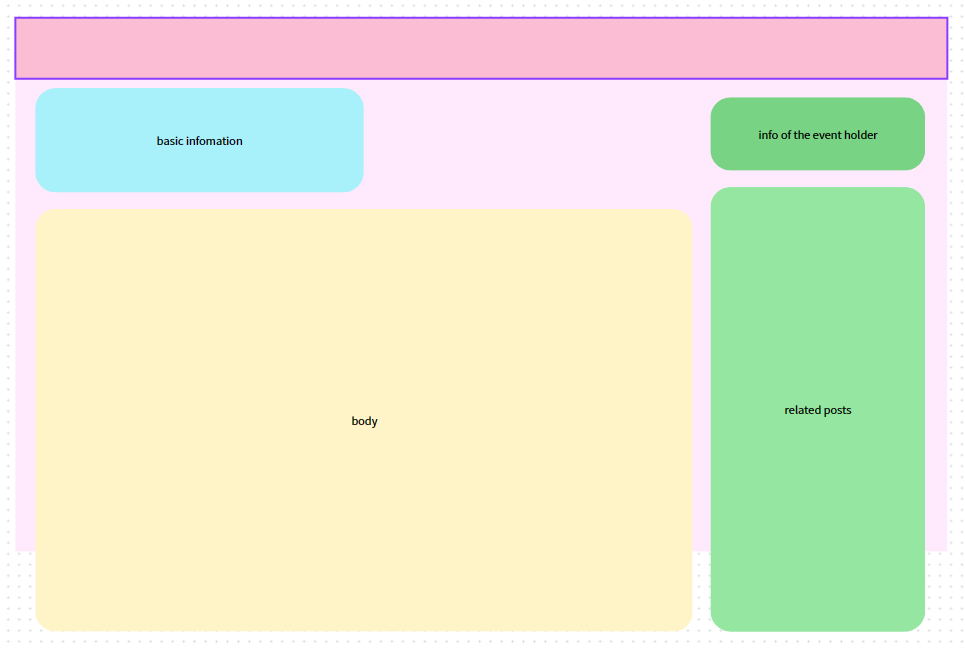
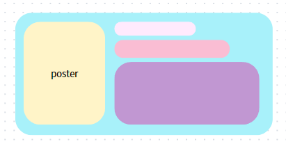
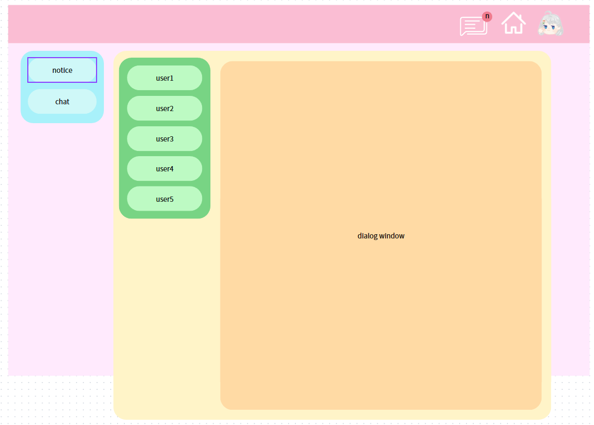
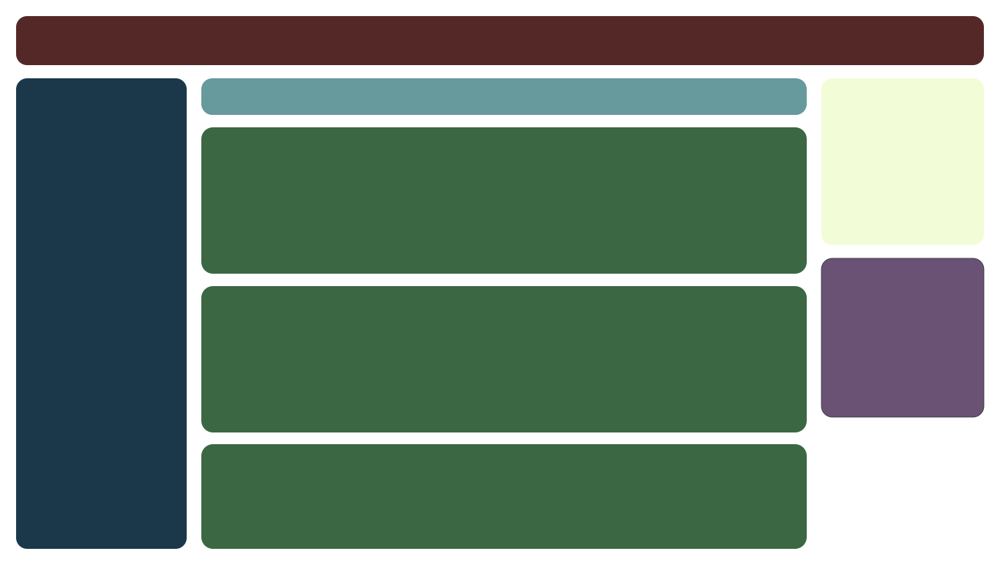
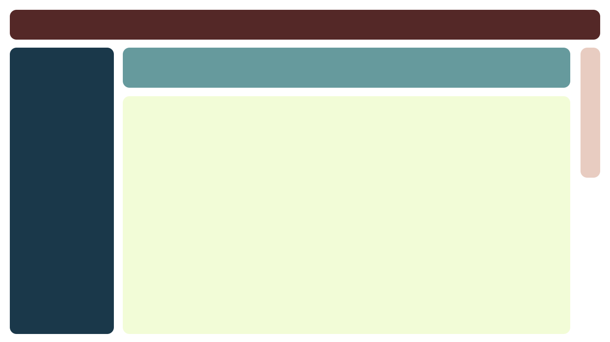
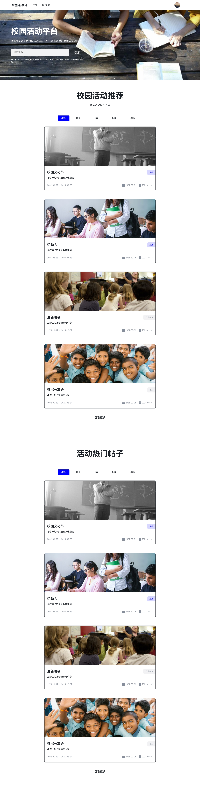
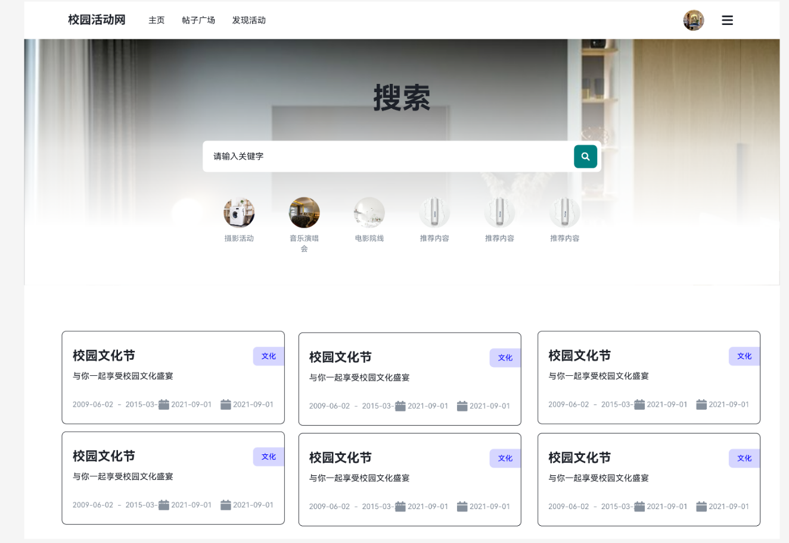

# CS304 Project Proposal

**Project Title: Campus Events and Entertainment Center**

[PPT link](https://www.canva.cn/design/DAGCYtnNrFM/GuQyQc4o-4rSKQwtrB3zlA/view?utm_content=DAGCYtnNrFM&utm_campaign=designshare&utm_medium=link&utm_source=editor)

## Part I. Architecture & UI Design

### Architectural Design

#### Frontend

This is the architecture of the frontend, which was designed at the beginning of the project. The architecture shows the logic of the page-routing and the most important components of each page. The frontend is separated into user-end and admin-end. 

The admin-end is to manage the authority of the users, delete events or posts. The user-end is to show the events and posts. For the users with the authority to create events, they can create events using the user-end. 

In the user-end, once the user logs in, the users can see the events and posts at the main page. They can click the events or search for the events they are interested in. For the detail page of an event, the users can see the information of the event, apply for the event, leave comments, and see the related posts. By clicking the posts on the event detail page, search for posts, click the posts on the main page, or go to the post square, the users can view the posts and leave comments. They can also write posts and link the posts to an event. Back to the main page, the users can edit their profile, see the events they have collected, and see the posts they have written. If the users have the authority to create events, they can turn to the event management page to create events, see the events they have created, and see the people who have applied for the events.

#### Backend

## comment

Our comments are divided into event comments and replies. Replies can be made to both event comments and other replies. Ultimately, the comment section will form a hierarchy, with each event comment being a section, under which there is a series of replies.

## event

Our events are not divided into many classes. Instead, we abstract the different stages that may occur in the lifecycle of various events and they can be freely combined. Currently, the only stage we have is enrollment.

## enrollment

There are many ways to enroll, such as free enrollment with quota restrictions and enrollment with registration form review, etc. At the same time, various registration methods may also have common subsequent stages, such as seat selection.

Each of our enrollment entity classes corresponds to a unique event entity class and is responsible for saving the enrollment information of that event.

## user

We divide all users into administrators and users. Their functions do not intersect. Administrators can only enter the management page, while users can only enter the user interface. The user's permission system allows each permission to be separately authorized by the administrator, such as creating activities, posting comments, etc.

### UI Design

#### Event Detail page

#### Event Card

#### Message Page

### Post Square

On the main page of PostSquare, in addition to the header and aside, there is a sub-header, thumbnail cards for various posts, a carousel for popular or recommended posts, global notifications, and more.

In the sub-header, there are various commonly used buttons along with a search box for finding posts of interest. The thumbnail images of posts provide the title, image, and some content of the post, along with shortcuts for liking, bookmarking, sharing, and the corresponding number of users who have taken these actions. Clicking on the other parts will pop up a window to enter the detailed content page of the post. The carousel can showcase popular posts or events and provide a way to navigate to them. Global notifications facilitate notifications for campus-level activities or announcements from administrators.

### Post Details

In the post details page, in addition to the header and aside, there is a subheader and button group that is affixed for stability, along with the post content and corresponding comments. The subheader displays the post title, information about the poster, and a link to the event (if available). The button group provides shortcuts for almost all functionalities on the page, such as liking, bookmarking, commenting, sharing, navigating to events, and guided tours. A button at the bottom right corner of the page allows for a quick return to the top of the page.

**For now, Post Square and Post Detail have implemented feature "Share Activity Content and Experiences Through Posts".**

### Main Page

This is the homepage, where users can easily navigate to their desired pages through the navigation bar or manage their personal information by clicking on their avatar. Below is a search bar where users can search for activities they are interested in. Next, there's a carousel displaying popular activities to help users filter. Following that, there are some featured posts to assist users in evaluating whether a particular activity is worth participating in.

### search Page

This is the search page, starting with a header for easy navigation. Following that is the search bar, beneath which are activity categories for users to filter by. Below that are activity cards displaying information about the activities that users have searched for.
